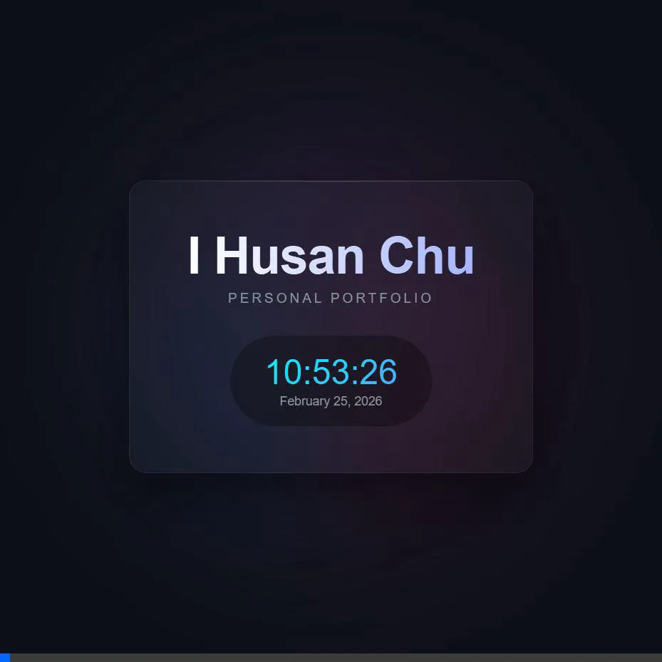

# Personal Website - I Husan Chu

A modern, single-page personal website displaying a name and a real-time clock.

## Live Demo

## Features

- **Modern Aesthetic:** Built with a sleek, dark-mode glassmorphism design using vanilla HTML and CSS.
- **Dynamic Glow Effect:** Includes a background glow with conic gradients that rotates continuously.
- **Custom Typography:** Utilizes the Google Font *Outfit* for a contemporary feel.
- **Live Clock:** Displays the current time and date, updating every second to reflect real-time changes using JavaScript.

## Tech Stack

- HTML5
- CSS3 (Vanilla)
- JavaScript (Vanilla)

## How to use

1. Clone or download this repository/folder.
2. Open `index.html` in any modern web browser (Chrome, Firefox, Safari, Edge, etc.).
3. No build steps, dependencies, or local servers are required!

## Project Structure

- `index.html`: The main and only file containing the structure, styling, and logic for the page.
- `demo.webp`: A short recording showing the live clock in action.
